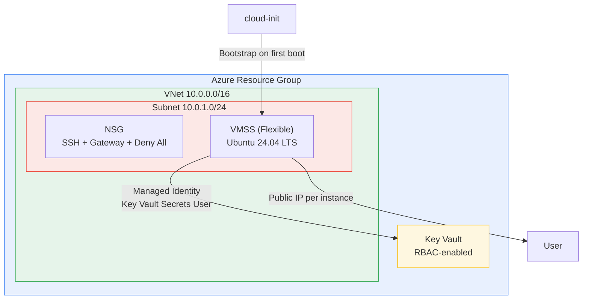

# OpenClaw on Azure VMSS

[](https://codespaces.new/deankroker/openclaw-on-azure)
[](https://vscode.dev/redirect?url=vscode://ms-vscode-remote.remote-containers/cloneInVolume?url=https://github.com/deankroker/openclaw-on-azure)
[](https://discord.com/invite/microsoft-azure)

Deploy [OpenClaw](https://github.com/openclaw) on Azure Virtual Machine Scale Sets using Bicep and the Azure CLI. One VMSS instance per person, each with its own public IP for direct WebSocket and SSH access.

## What you get

- **Dedicated VM** per user — full SSH access, no shared tenancy
- **Key Vault secrets** — API keys stored once, shared across all instances via managed identity
- **NSG locked to your IP** — deploy auto-detects your IP and restricts inbound traffic
- **30 GB persistent OS disk** — survives VM restarts and stop/start cycles (suggest having OpenCode write to Notion. Otherwise, set up snapshots/disk storage)
- **~$30/month** for a dev instance (`Standard_B2s`)

## Prerequisites

1. **Azure subscription** with Contributor access

2. **Azure CLI** — [install guide](https://learn.microsoft.com/en-us/cli/azure/install-azure-cli)
   ```bash
   az --version       # confirm installed
   az login           # authenticate
   ```

3. **SSH key pair** (optional for team deploys — Entra ID replaces SSH keys)
   ```bash
   ls ~/.ssh/id_rsa.pub   # check for existing key
   # If missing and you want SSH key fallback:
   ssh-keygen -t rsa -b 4096
   ```

4. **Azure CLI SSH extension** (required for team members using `az ssh vm`)
   ```bash
   az extension add --name ssh
   ```

5. **jq** — [install guide](https://jqlang.github.io/jq/)
   ```bash
   jq --version       # confirm installed
   ```

6. **API keys** for Anthropic or OpenAI (see Step 2 below)

## Getting started

### Step 1: Clone

```bash
git clone https://github.com/deankroker/openclaw-on-azure && cd openclaw-on-azure
```

### Step 2: Create config files

```bash
cp secrets.example.json secrets.json
```

Edit `secrets.json` with your API keys.

For **team deploys**, also create a `team.json` (see [`team.example.json`](team.example.json)):

```bash
cp team.example.json team.json
```

Edit `team.json` with your team members' Entra ID emails. See [Team access](#team-access) for details.

API keys:

| Key | Required? | Where to get it |
|---|---|---|
| `ANTHROPIC_API_KEY` | Yes (default provider) | [console.anthropic.com/settings/keys](https://console.anthropic.com/settings/keys) |
| `OPENAI_API_KEY` | Optional | [platform.openai.com/api-keys](https://platform.openai.com/api-keys) |

You need at least one key. The default config uses Anthropic (`claude-sonnet-4-20250514`), so an Anthropic key is the simplest path.

### Step 3: Deploy

```bash
./scripts/deploy.sh
```

This creates a resource group, deploys the Bicep template (VNet, NSG, Key Vault, VMSS), uploads your secrets to Key Vault, and starts a VM. Your public IP is auto-detected and used to lock down inbound NSG rules — only you can reach the VM.

Pass `--open` to allow inbound traffic from any IP (not recommended).

### Step 4: Wait for bootstrap

The VM provisions itself on first boot via cloud-init. This takes **3-5 minutes** — Key Vault RBAC propagation is the bottleneck.

**Do not SSH in immediately.** The VM is installing Node.js, pulling secrets from Key Vault, and starting the OpenClaw service. If you connect too early, the service won't be running yet.

### Step 5: SSH in and verify

```bash
./scripts/ssh-to-instance.sh
```

Once connected, confirm everything is running:

```bash
# Check that cloud-init finished successfully
tail -5 /var/log/openclaw-setup.log

# Check the OpenClaw gateway service
systemctl --user status openclaw-gateway
```

You should see the service as `active (running)`. If not, check the [Troubleshooting](#troubleshooting) section.

## Team access

For teams where multiple people need their own VM instance, `team.json` replaces SSH key distribution with Entra ID authentication. Each team member gets their own instance and connects with `az ssh vm` — no SSH keys needed.

### Deployer setup

1. Create `team.json` from the example:
   ```bash
   cp team.example.json team.json
   ```

2. Add team members (one per line, order = instance assignment):
   ```json
   {
     "members": [
       { "email": "alice@contoso.com" },
       { "email": "bob@contoso.com" }
     ]
   }
   ```

3. Deploy as usual:
   ```bash
   ./scripts/deploy.sh
   ```

   The deploy script will:
   - Resolve each email to an Entra ID object ID
   - Auto-set instance count to match team size
   - Open SSH NSG to `*` (Entra ID is the auth boundary; gateway stays locked to deployer IP)
   - Install the `AADSSHLoginForLinux` VM extension
   - Assign the `Virtual Machine User Login` RBAC role to each member
   - Print a table mapping members to instances with ready-to-use `az ssh vm` commands

### Team member setup

Send each team member these four commands:

```bash
# 1. Install Azure CLI
#    https://learn.microsoft.com/en-us/cli/azure/install-azure-cli

# 2. Install SSH extension
az extension add --name ssh

# 3. Log in
az login

# 4. Connect (deployer provides the exact instance name)
az ssh vm --resource-group openclaw-rg --name openclaw000001
```

No SSH keys, no repo clone needed. If a team member has the repo cloned, they can also use:

```bash
./scripts/ssh-to-instance.sh --entra
```

### How it works

- `team.json` is only used by deploy scripts — it never gets uploaded to Key Vault or VMs
- If `~/.ssh/id_rsa.pub` exists, the deployer's SSH key is baked in as an admin fallback
- Without `team.json`, everything works exactly as before (single-user mode)

## Data persistence

Each VM has a 30 GB managed OS disk (`Standard_LRS`). Data persists across:

- **VM restarts** (reboot)
- **Stop/start cycles** (deallocate and reallocate)

Data is **destroyed** when you:

- Delete the VM or VMSS
- Reimage the instance
- Delete the resource group (`./scripts/teardown.sh`)

## Architecture



Each VMSS instance provisions itself on first boot via cloud-init: installs Node.js 22, pulls secrets from Key Vault using its managed identity, installs OpenClaw, and starts a systemd service.

## Configuration

### Infrastructure parameters (`infra/main.bicepparam`)

VM size, instance count, and other infrastructure settings are defined in `infra/main.bicepparam`. Edit this file directly to change infrastructure configuration.

| Parameter | Default | Description |
|---|---|---|
| `environment` | `dev` | Environment name (used for resource naming and tagging) |
| `instanceCount` | `1` | Number of VMSS instances (1 per person) |
| `vmSize` | `Standard_B2s` | VM size (`Standard_B2s` for dev, `Standard_B4ms` for prod) |
| `adminUsername` | `openclaw` | Admin username on VMs |
| `openclawPort` | `18789` | OpenClaw gateway port |

### Secrets (`secrets.json`)

See [`secrets.example.json`](secrets.example.json) for the expected format. This JSON object is stored in Key Vault and pulled by each VM at boot.

### OpenClaw config

The gateway config template lives at `config/openclaw.template.json`. To push config changes to running instances without redeploying:

```bash
./scripts/update-config.sh [path/to/config.json]
```

### Deployment overrides

For power users: create a `.env` file in the project root to override deployment orchestration defaults. These control where and how resources are deployed, not what gets deployed.

| Variable | Default | Description |
|---|---|---|
| `AZURE_SUBSCRIPTION` | *(current CLI subscription)* | Azure subscription ID |
| `RESOURCE_GROUP` | `openclaw-rg` | Azure resource group name |
| `LOCATION` | `eastus2` | Azure region |
| `SSH_KEY_PATH` | `~/.ssh/id_rsa.pub` | Path to SSH public key |
| `SECRETS_FILE` | `./secrets.json` | Path to secrets JSON file |
| `ADMIN_USERNAME` | `openclaw` | Admin username on VMs |

## How it works

1. **`deploy.sh`** creates a resource group and deploys the Bicep template using `infra/main.bicepparam` for infrastructure parameters and CLI overrides for secrets and dynamic values.
2. **Bicep** provisions a VNet + NSG, Key Vault (stores your secrets JSON), and a VMSS.
3. **On first boot**, each VM runs a cloud-init script that:
   - Installs Node.js 22, pnpm, Azure CLI, and Claude Code CLI
   - Authenticates to Azure via the VM's managed identity
   - Waits for Key Vault RBAC to propagate (can take 1-5 min)
   - Pulls secrets from Key Vault
   - Installs OpenClaw and writes its config
   - Creates and starts a systemd user service (`openclaw-gateway`)
4. **You SSH in** and start using OpenClaw. Secrets are in-memory on the VM and in Key Vault — never on disk unencrypted, never in your Bicep files.

## Scripts reference

| Script | Usage | Description |
|---|---|---|
| `deploy.sh` | `./scripts/deploy.sh [--open]` | Deploy infrastructure. `--open` allows inbound traffic from any IP (default: restricts to your IP). |
| `scale.sh` | `./scripts/scale.sh --count N` | Scale the VMSS to N instances. New instances bootstrap automatically via cloud-init. |
| `ssh-to-instance.sh` | `./scripts/ssh-to-instance.sh [--entra] [index]` | SSH into an instance by index (default: 0). `--entra` uses Entra ID auth via `az ssh vm`. Auto-detects if no SSH key exists. |
| `update-config.sh` | `./scripts/update-config.sh [config-file]` | Push updated gateway config to all running instances (default: `config/openclaw.template.json`). |
| `teardown.sh` | `./scripts/teardown.sh [--force]` | Delete the resource group and all resources. `--force` skips confirmation. |

## Design decisions

| Decision | Rationale |
|---|---|
| **VMSS Flex** | Per-instance public IPs without a load balancer. Instances act like standalone VMs but are managed as a group. |
| **Key Vault + managed identity** | Secrets never touch Bicep files or disk. VMs authenticate via system-assigned identity — no credentials to rotate. |
| **cloud-init (not custom images)** | Installs the latest versions of Ubuntu. No image pipeline to maintain. Trade-off: first boot takes ~5 min. |
| **`.bicepparam` for infra params** | Idiomatic Bicep pattern. Infrastructure configuration lives next to the template it parameterizes. Secrets and dynamic values are passed as CLI overrides. |
| **systemd user service** | Runs OpenClaw as the `openclaw` user, not root. Survives reboots via `loginctl enable-linger`. |

## Cost estimate

| Environment | VM Size | Instances | Est. Monthly |
|---|---|---|---|
| dev | Standard_B2s (2 vCPU, 4 GB) | 1 | ~$30 |
| prod | Standard_B4ms (4 vCPU, 16 GB) | 2 | ~$240 |

Costs vary by region. Deallocate instances when not in use to stop compute charges.

[Azure Pricing Calculator](https://azure.microsoft.com/en-us/pricing/calculator/) for exact numbers.

## Security

- **NSG source restriction**: Deploy auto-locks to your IP. Use `--open` only if you understand the risk.
- **Key Vault + managed identity**: Secrets stored in Key Vault, accessed via managed identity. No credentials on disk.
- **SSH-only auth**: Password authentication disabled on all VMs.
- **TrustedLaunch**: Secure Boot and vTPM enabled on all instances.
- **Soft delete**: Key Vault has 7-day soft delete retention.
- **Resource tags**: All resources are tagged with `project` and `environment` for cost tracking and governance.

## Troubleshooting

**Most common issue: SSHing in too early.** The VM needs 3-5 minutes after deployment to finish cloud-init. If the OpenClaw service isn't running, wait and check again. See [Step 4: Wait for bootstrap](#step-4-wait-for-bootstrap).

```bash
# SSH into an instance
./scripts/ssh-to-instance.sh        # first instance (index 0)
./scripts/ssh-to-instance.sh 1      # second instance

# Check cloud-init progress (runs on first boot)
tail -f /var/log/openclaw-setup.log
sudo cat /var/log/cloud-init-output.log

# Check the OpenClaw gateway service
systemctl --user status openclaw-gateway
journalctl --user -u openclaw-gateway -f
```

Cloud-init may take 5+ minutes on first boot — Key Vault RBAC propagation is the bottleneck.

**Team/Entra ID issues:**

- **RBAC propagation delay**: After deployment, the `Virtual Machine User Login` role assignment can take 5-10 minutes to propagate. If `az ssh vm` returns a permissions error, wait and retry.
- **`az ssh` extension required**: Team members must install the SSH extension (`az extension add --name ssh`). Without it, `az ssh vm` won't be available.
- **Wrong tenant**: If a team member's email can't be resolved during deploy, they may not exist in the current Entra ID tenant. Check with `az ad user show --id user@example.com`.

## Teardown

```bash
./scripts/teardown.sh          # interactive confirmation
./scripts/teardown.sh --force  # skip confirmation
```

Deletes the entire resource group and all resources within it.

## Roadmap

- **Azure Service Groups**: Group related resources visually in the portal. Currently preview-only with REST API access — no Bicep support yet. Will add when GA with Bicep support.

## Contributing

See [CONTRIBUTING.md](CONTRIBUTING.md).
