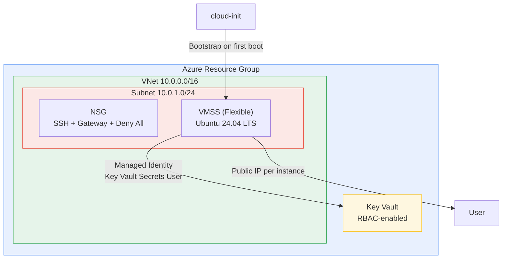

# OpenClaw on Azure VMSS

[](https://codespaces.new/deankroker/openclaw-on-azure)
[](https://vscode.dev/redirect?url=vscode://ms-vscode-remote.remote-containers/cloneInVolume?url=https://github.com/deankroker/openclaw-on-azure)
[](https://discord.com/invite/microsoft-azure)

Deploy [OpenClaw](https://github.com/openclaw) on Azure Virtual Machine Scale Sets using Bicep and the Azure CLI. One VMSS instance per person, each with its own public IP for direct WebSocket and SSH access.

## Architecture



Each VMSS instance provisions itself on first boot via cloud-init: installs Node.js 22, pulls secrets from Key Vault using its managed identity, installs OpenClaw, and starts a systemd service.

### Why VMSS?

This project uses a **1 instance = 1 person** model. VMSS gives you:

- **Per-instance public IPs** without a load balancer or NAT gateway — direct SSH and WebSocket access.
- **Scale to zero** (or as many as you need) with a single command.
- **Identical provisioning** via cloud-init — every instance bootstraps the same way.
- **Flexible orchestration mode** — instances behave like standalone VMs but are managed as a group.

A container-based approach (ACI, AKS) would add complexity for a workload that benefits from per-user isolation and persistent SSH access.

## Prerequisites

- Azure subscription with Contributor access
- [Azure CLI](https://learn.microsoft.com/en-us/cli/azure/install-azure-cli) installed and logged in (`az login`)
- SSH key pair (`ssh-keygen -t rsa -b 4096` if you don't have one)
- [jq](https://jqlang.github.io/jq/) installed
- API keys for your AI providers (Anthropic, OpenAI, etc.)

## Quickstart

```bash
# 1. Clone
git clone https://github.com/deankroker/openclaw-on-azure && cd openclaw-on-azure

# 2. Create secrets file
cp secrets.example.json secrets.json
# Edit secrets.json with your API keys

# 3. Deploy
./scripts/deploy.sh

# 4. SSH in
./scripts/ssh-to-instance.sh
```

> **Tip:** The deploy script auto-detects your public IP and locks down NSG rules to it. Use `--open` to allow all IPs instead (not recommended for production).

## Configuration

### Infrastructure parameters (`infra/main.bicepparam`)

VM size, instance count, and other infrastructure settings are defined in `infra/main.bicepparam`. Edit this file directly to change infrastructure configuration.

| Parameter | Default | Description |
|---|---|---|
| `environment` | `dev` | Environment name (used for resource naming and tagging) |
| `instanceCount` | `1` | Number of VMSS instances (1 per person) |
| `vmSize` | `Standard_B2s` | VM size (`Standard_B2s` for dev, `Standard_B4ms` for prod) |
| `adminUsername` | `openclaw` | Admin username on VMs |
| `openclawPort` | `18789` | OpenClaw gateway port |

### Secrets (`secrets.json`)

See [`secrets.example.json`](secrets.example.json) for the expected format. This JSON object is stored in Key Vault and pulled by each VM at boot.

### OpenClaw config

The gateway config template lives at `config/openclaw.template.json`. To push config changes to running instances without redeploying:

```bash
./scripts/update-config.sh [path/to/config.json]
```

### Deployment overrides

For power users: create a `.env` file in the project root to override deployment orchestration defaults. These control where and how resources are deployed, not what gets deployed.

| Variable | Default | Description |
|---|---|---|
| `AZURE_SUBSCRIPTION` | *(current CLI subscription)* | Azure subscription ID |
| `RESOURCE_GROUP` | `openclaw-rg` | Azure resource group name |
| `LOCATION` | `eastus2` | Azure region |
| `SSH_KEY_PATH` | `~/.ssh/id_rsa.pub` | Path to SSH public key |
| `SECRETS_FILE` | `./secrets.json` | Path to secrets JSON file |
| `ADMIN_USERNAME` | `openclaw` | Admin username on VMs |

## How it works

1. **`deploy.sh`** creates a resource group and deploys the Bicep template using `infra/main.bicepparam` for infrastructure parameters and CLI overrides for secrets and dynamic values.
2. **Bicep** provisions a VNet + NSG, Key Vault (stores your secrets JSON), and a VMSS.
3. **On first boot**, each VM runs a cloud-init script that:
   - Installs Node.js 22, pnpm, Azure CLI, and Claude Code CLI
   - Authenticates to Azure via the VM's managed identity
   - Waits for Key Vault RBAC to propagate (can take 1-5 min)
   - Pulls secrets from Key Vault
   - Installs OpenClaw and writes its config
   - Creates and starts a systemd user service (`openclaw-gateway`)
4. **You SSH in** and start using OpenClaw. Secrets are in-memory on the VM and in Key Vault — never on disk unencrypted, never in your Bicep files.

## Scripts reference

| Script | Usage | Description |
|---|---|---|
| `deploy.sh` | `./scripts/deploy.sh [--open]` | Deploy infrastructure. `--open` allows inbound traffic from any IP (default: restricts to your IP). |
| `scale.sh` | `./scripts/scale.sh --count N` | Scale the VMSS to N instances. New instances bootstrap automatically via cloud-init. |
| `ssh-to-instance.sh` | `./scripts/ssh-to-instance.sh [index]` | SSH into an instance by index (default: 0). |
| `update-config.sh` | `./scripts/update-config.sh [config-file]` | Push updated gateway config to all running instances (default: `config/openclaw.template.json`). |
| `teardown.sh` | `./scripts/teardown.sh [--force]` | Delete the resource group and all resources. `--force` skips confirmation. |

## Design decisions

| Decision | Rationale |
|---|---|
| **VMSS Flexible mode** | Per-instance public IPs without a load balancer. Instances act like standalone VMs but are managed as a group. |
| **No load balancer** | Each person connects directly to their instance via SSH or WebSocket. There's nothing to balance. |
| **Key Vault + managed identity** | Secrets never touch Bicep files or disk. VMs authenticate via system-assigned identity — no credentials to rotate. |
| **cloud-init (not custom images)** | Always installs the latest versions at boot. No image pipeline to maintain. Trade-off: first boot takes ~5 min. |
| **RBAC over access policies** | Key Vault access policies are legacy. RBAC is the Microsoft-recommended approach and integrates with Azure AD. |
| **Explicit deny-all NSG rule** | Defense in depth. Azure has an implicit deny, but making it explicit documents intent and survives subnet reassignment. |
| **Auto-detected source CIDR** | The deploy script locks NSG rules to your IP by default. `--open` flag is opt-in, with a warning. |
| **`.bicepparam` for infra params** | Idiomatic Bicep pattern. Infrastructure configuration lives next to the template it parameterizes. Secrets and dynamic values are passed as CLI overrides. |
| **systemd user service** | Runs OpenClaw as the `openclaw` user, not root. Survives reboots via `loginctl enable-linger`. |
| **TrustedLaunch** | Secure Boot + vTPM. Free, no reason not to enable it. |

## Cost estimate

| Environment | VM Size | Instances | Est. Monthly |
|---|---|---|---|
| dev | Standard_B2s (2 vCPU, 4 GB) | 1 | ~$30 |
| prod | Standard_B4ms (4 vCPU, 16 GB) | 2 | ~$240 |

Costs vary by region. Deallocate instances when not in use to stop compute charges.

[Azure Pricing Calculator](https://azure.microsoft.com/en-us/pricing/calculator/) for exact numbers.

## Security

- **NSG source restriction**: Deploy auto-locks to your IP. Use `--open` only if you understand the risk.
- **Key Vault + managed identity**: Secrets stored in Key Vault, accessed via managed identity. No credentials on disk.
- **SSH-only auth**: Password authentication disabled on all VMs.
- **TrustedLaunch**: Secure Boot and vTPM enabled on all instances.
- **Soft delete**: Key Vault has 7-day soft delete retention.
- **Resource tags**: All resources are tagged with `project` and `environment` for cost tracking and governance.

## Troubleshooting

```bash
# SSH into an instance
./scripts/ssh-to-instance.sh        # first instance (index 0)
./scripts/ssh-to-instance.sh 1      # second instance

# Check cloud-init progress (runs on first boot)
tail -f /var/log/openclaw-setup.log
sudo cat /var/log/cloud-init-output.log

# Check the OpenClaw gateway service
systemctl --user status openclaw-gateway
journalctl --user -u openclaw-gateway -f
```

Cloud-init may take 5+ minutes on first boot — Key Vault RBAC propagation is the bottleneck.

## Teardown

```bash
./scripts/teardown.sh          # interactive confirmation
./scripts/teardown.sh --force  # skip confirmation
```

Deletes the entire resource group and all resources within it.

## Roadmap

- **Azure Service Groups**: Group related resources visually in the portal. Currently preview-only with REST API access — no Bicep support yet. Will add when GA with Bicep support.

## Contributing

See [CONTRIBUTING.md](CONTRIBUTING.md).
# openclaw-on-azure
